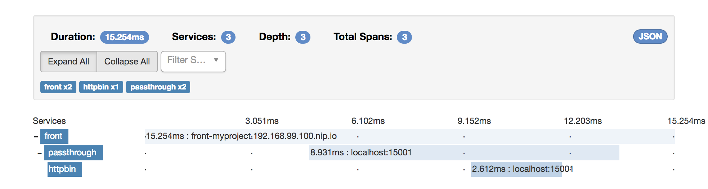
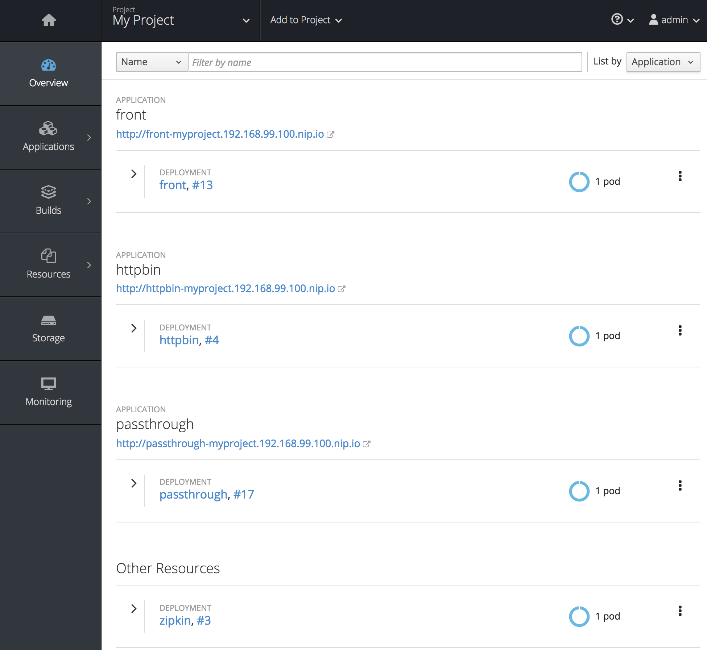

# Envoy Service Proxy Example

This repo contains a sample application that uses [Envoy][envoy] as service proxy. It was meant to get familiar with [Envoy][envoy] and to experiment with an actual [kubernetes][kubernetes] setup (more specifically, I've used [OpenShift][minishift] as orchestrator).

## Application-Setup

        +------+                +------+                +------+         
        | POD  +--------+       | POD  +--------+       | POD  +--------+ 
       ,-----------------.     ,-----------------.     ,-----------------.
    -->|  envoy-sidecar  |---->|  envoy-sidecar  |---->|  envoy-sidecar  |
       `-----------------'     `-----------------'     `-----------------'
        |    ↓     ↑    |       |    ↓     ↑    |       |    ↓     ↑    | 
        | ,-----------. |       | ,-----------. |       | ,-----------. | 
        | | front-app | |       | |  passthr. | |       | |  h︎ttpbin  | | 
        | `-----------' |       | `-----------' |       | `-----------' | 
        +-------------- +       +---------------+       +---------------+ 

As the diagram above depicts there are three chained applications where [httpbin][httpbin], as the application whose endpoints we'd like to consume, is located at the very end of that chain.

As suggested in [Christan Posta's blog series][chris_posta] I've deployed [Envoy][envoy] as a [sidecar][sidecar] to the actual application - by this means it's possible to equip even third party apps as [httpbin][httpbin] with additional functionality like [circuit breaker][circuitbreaker] or in my case distributed tracing support using [Zipkin][zipkin].

`Front` as well as `Passthrough` are custom [Spring Boot][springboot] applications which only pass the given request along the chain to the next element, so nothing exciting here (actually, both times it's the same application realized as a [Zuul Proxy][zuul] - don't get confused with all the proxies, it's only meant to pass requests along the chain).

Finally, and this is not shown in the diagram above, I've also deployed a [Zipkin Server][zipkin] so we can actually see who is calling what. 

## Deployment

### Environment to be created

As I've said, I used __OpenShift__ as container orchestrator - more specifically I've installed [Minishift][minishift]. Follow the installation instructions - the default setup is just fine. At least make sure you have a project named `myproject`.

### Images to be build

For `httpbin` you don't have anything to do. The used [Docker-Image][httpbindocker] is publicly available in Docker-Hub.

The Spring-Boot application although has to be build and packaged as a Docker container. So, change into the `passthrough` directory and execute:

    mvn clean install && \
        docker build -t $(minishift openshift registry)/myproject/passthrough . && \
        docker push $(minishift openshift registry)/myproject/passthrough
        
This should build the java app, package it within a container and pushes it to [minishifts][minishift] Docker registry (assuming you've setup [minishift][minishift] accordingly).

### Deploying to Openshift

If everything went fine so far switch back into the root-folder and apply all YAML-files (contained in `k8s`-folder).

    oc apply -R -f ./k8s

Now, be patient ... all components should come up now and finally you should see something like this (your deployment numbers should vary):

## Using the example

Now you should be able to call `httpbin`-endpoints through the application-chain we've created, starting at `front`:

    curl -s http://front-myproject.192.168.99.100.nip.io/api/get |jq
	{
	  "args": {},
	  "headers": {
	    "Accept": "*/*",
	    "Accept-Encoding": "gzip",
	    "Content-Length": "0",
	    "Forwarded": "for=192.168.99.1;host=front-myproject.192.168.99.100.nip.io;proto=http",
	    "Host": "127.0.0.1",
	    "User-Agent": "curl/7.54.0",
	    "X-B3-Parentspanid": "eb9fd51a63d0bddd",
	    "X-B3-Sampled": "1",
	    "X-B3-Spanid": "0793010ac55a85b4",
	    "X-B3-Traceid": "3052706fbfe11d03",
	    "X-Forwarded-Host": "front-myproject.192.168.99.100.nip.io,127.0.0.1,127.0.0.1",
	    "X-Forwarded-Prefix": "/api/api",
	    "X-Ot-Span-Context": "3052706fbfe11d03;0793010ac55a85b4;eb9fd51a63d0bddd",
	    "X-Request-Id": "ade3dc66-92c6-9d29-9980-3b12e926d2de"
	  },
	  "origin": "192.168.99.1, 127.0.0.1",
	  "url": "http,http,http://front-myproject.192.168.99.100.nip.io/get"
	}

You can see additional information like `SpanId` or `TraceId` which where added by [Envoy][envoy] to make distributed tracing possible. 

[zuul]:https://github.com/Netflix/zuul
[springboot]:https://projects.spring.io/spring-boot/
[circuitbreaker]:http://microservices.io/patterns/reliability/circuit-breaker.html
[sidecar]:http://blog.kubernetes.io/2015/06/the-distributed-system-toolkit-patterns.html
[envoy]:https://www.envoyproxy.io/
[zipkin]:https://zipkin.io/
[httpbin]:https://httpbin.org/
[httpbindocker]:https://hub.docker.com/r/citizenstig/httpbin/
[kubernetes]:https://kubernetes.io/
[minishift]:https://github.com/minishift/minishift
[minishift_install]:https://docs.openshift.org/latest/minishift/getting-started/installing.html
[chris_posta]:http://blog.christianposta.com/microservices/00-microservices-patterns-with-envoy-proxy-series/
[envoy_example]:https://github.com/envoyproxy/envoy/blob/master/examples/zipkin-tracing/service1-envoy-zipkin.yaml
